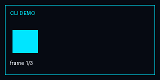
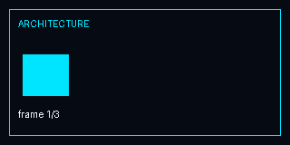

# CryoOmega ULTRA — Deutsche Übersicht

CryoOmega ULTRA ist eine technische Arbeitsumgebung für eine einheitliche CLI, TUI und browserbasierte Web IDE rund um den `omega-gateway`. Die Rechenlogik liegt im Gateway; CLI und IDE sind Clients.

## Schnellübersicht





Die GIFs sind lokale, illustrative Demonstrationen und kein Ersatz für CI- oder Laufzeitnachweise.

## Funktionsübersicht

| Funktion | Status | Einstieg |
|---|---|---|
| CLI | Verfügbar | `./bin/omega` |
| TUI/Chat | Verfügbar | `./bin/omega chat` |
| Gateway | Verfügbar | `./bin/omega gateway ...` |
| Web IDE | Verfügbar | `./bin/omega ide` |
| Agent Registry | Verfügbar | `./bin/omega agents ...` |
| Skills | Verfügbar | `./bin/omega skills ...` |
| Planner | Verfügbar | `./bin/omega plan ...` |
| Plugins | Verfügbar | `./bin/omega plugin ...` |
| Working Memory | 0.4-Linie | `~/.omega/memory/working` |
| SSE Chat Chunking | Verfügbar | `Accept: text/event-stream` |
| Strukturierte Gateway-Logs | Verfügbar | Gateway-Status/Logs |
| Health Endpoints | Verfügbar | `/api/health`, `/healthz` |
| Browser Extension | Repository-Komponente | `browser-extension/` |
| WebMCP | Integrationsspur | `docs/` |
| Testkube | Integrationsspur | `docs/` |
| GeoAI | Integrationsspur | `docs/` |

## Schnellstart

```bash
python -m venv .venv
. .venv/bin/activate
pip install -e ".[dev]"
./bin/omega doctor
./bin/omega chat
./bin/omega ide
```

## Dokumentation

- [Englische README](README.md)
- [Wiki](docs/wiki/index.md)
- [Architektur](docs/architecture.md)
- [API](docs/api.md)
- [Konfiguration](docs/configuration.md)
- [Testing](docs/testing.md)
- [Operations](docs/operations.md)
- [Security](SECURITY.md)
- [CHANGELOG](CHANGELOG.md)
- [GitHub-Lernpfad](docs/wiki/github-learning.md)
- [Dateitypen](docs/file-types.de.md)
- [Lizenz & Assets](docs/license-and-assets.md)

## Sicherheit

Der lokale Gateway-Betrieb ist standardmäßig loopback-orientiert. Remote-Binding darf nur bewusst aktiviert und zusätzlich abgesichert werden. Geheimnisse gehören nicht in Git. Plugins werden im Prozess geladen und müssen als vertrauenswürdiger Code behandelt werden.

## Lizenz

CryoOmega ULTRA steht unter der MIT-Lizenz. Der verbindliche Lizenztext ist [`LICENSE`](LICENSE). Regeln für Projektgrafiken und Dokumentations-Assets stehen in [`docs/license-and-assets.md`](docs/license-and-assets.md).
