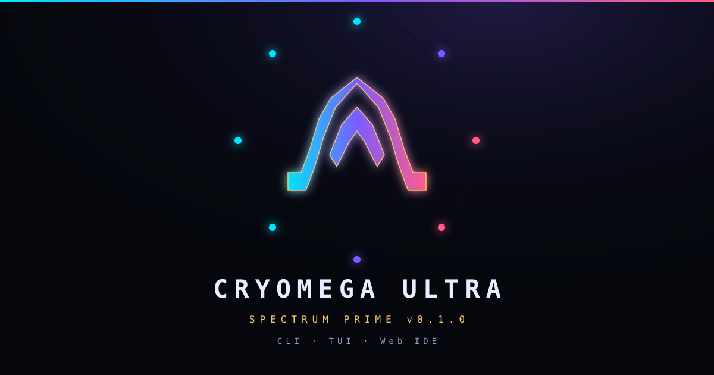
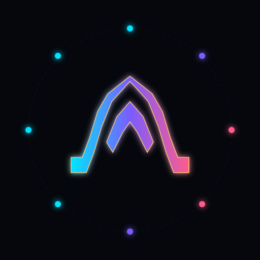

<p align="center">
  
</p>

<p align="center">
  
</p>

<h1 align="center">CryoOmega ULTRA</h1>

<p align="center"><strong>CryoOmega ULTRA unified CLI, TUI, and Web IDE (v0.2.2 OmniLink)</strong></p>

A unified command-line tool, interactive TUI, and browser-based IDE workspace for Cryo Omega autonomous agents and skills orchestration. Computation lives in the **`omega-gateway`** engine service; the CLI and the IDE are lightweight clients.

## Features

- **Gateway engine**: `omega-gateway` service owns all computation (REST + static IDE);
  CLI and IDE are clients; data lives in `~/.omega/`
- **Live LLM in the IDE**: browser chat reaches the real provider failover chain
  (minimax → anthropic → openai, offline echo fallback) via `POST /api/chat`
- **Agent registry**: named persona profiles (`~/.omega/agents.json`);
  `omega agents list|info|run|add|rm`
- **TUI & Chat** (`omega chat`): gateway-backed, slash commands `/agent /agents /plan /skills /model`
- **Skills Integration** (`omega skills list|search|add|info`)
- **Execution Planner** (`omega plan "<task>"`)
- **Web IDE** (`omega ide` · `omega chat --web`): explorer, editor, chat, skills/agent
  drawers, Ctrl-K palette
- **System Doctor** (`omega doctor`); engine control (`omega gateway status|start|stop|restart|log`)
- **Plugins**: installable extensions adding web routes (`omega plugin list|install|info|enable|disable|rm`; example in `examples/plugins/omega-hello`)
- **SSE streaming** *(P2, not shipped)*: planned token streaming; `/api/chat` currently returns JSON

## Structure

```
.
├── assets/               # Spectrum Prime identity (mark, OG)
├── bin/
│   ├── omega             # CLI entrypoint (gateway client)
│   └── omega-gateway     # Engine service (REST + static IDE)
├── ide/
│   └── index.html        # Self-contained Web IDE interface
└── lib/
    └── ultra/            # Core package (agents, client, config, doctor,
                          #   gateway, llm, plugins, skills, tui)
```
- `examples/plugins/` — installable reference plugins
- `tools/eval_omnilink.py` — 5-dimension eval harness (A021 gateway)

## Quick Start

```bash
# Add bin/ to your PATH or run directly:
./bin/omega doctor          # local checks + gateway reachability

# Interactive TUI chat (auto-starts the gateway in the background)
./bin/omega chat

# Launch the Web IDE
./bin/omega ide

# Run/monitor the engine directly
./bin/omega gateway start
./bin/omega gateway status
./bin/omega-gateway         # foreground engine
```

## Spectrum Prime

Identity extends the Cryo Omega Line (crystalline Ω, orbital nodes) with the IDE spectrum:

| Token | Hex |
|---|---|
| void | `#05070d` |
| cyan | `#00e5ff` |
| violet | `#7b5cff` |
| rose | `#ff5c8a` |
| gold | `#f5c56b` |

The live IDE is `ide/index.html`. Wordmark and version strings live in `assets/og.svg` (code-built) so the product name stays exact.


## Documentation
- [Architecture](docs/architecture.md) · [Development](docs/development.md) · [Configuration](docs/configuration.md)
- [API](docs/api.md) · [Plugins](docs/plugin-system.md) · [Testing](docs/testing.md) · [Operations](docs/operations.md)
- [SECURITY](SECURITY.md) · [Threat model](docs/security/threat-model.md) · [Changelog](CHANGELOG.md)
- ADRs: `docs/adr/` · Runbooks: `docs/runbooks/`

## Foundation (0.2.1)

- Packaging: `pyproject.toml` (`pip install -e ".[dev]"`), portable shebangs, `.env.example`
- `omega doctor` exits **1** on hard failures; soft warnings (`providers`, `skills`, `gateway`, …) keep exit 0
- Gateway binds loopback by default; non-loopback requires `OMEGA_GATEWAY_ALLOW_REMOTE=1`
- ADRs under `docs/adr/`

## License


MIT License
